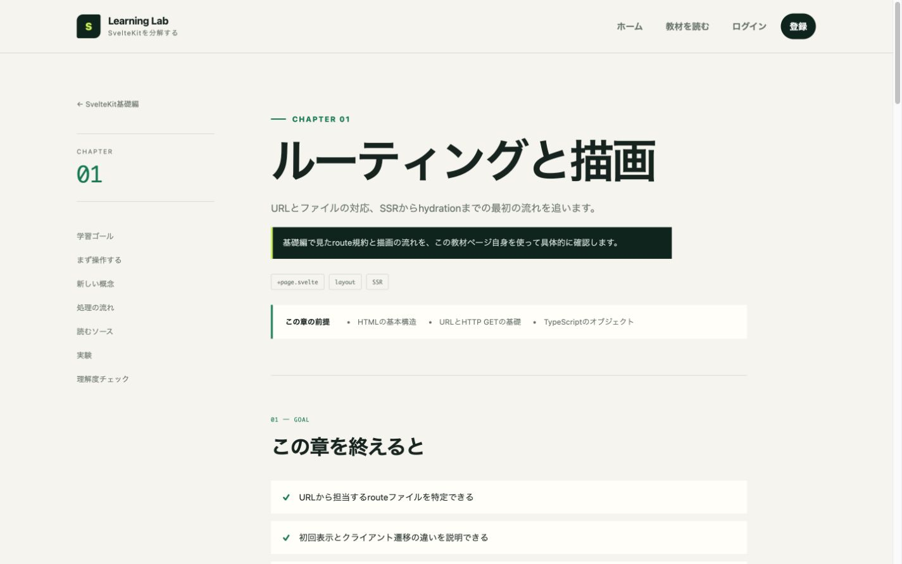
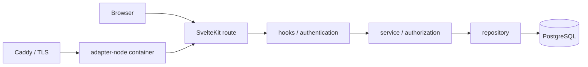

# SvelteKit Learning Lab

[](https://github.com/hirot192/sveltekit-learning-lab/actions/workflows/ci.yml)
[](LICENSE)

動くメモアプリとソースコードを往復しながら、SvelteKitの「なぜ動くのか」を学ぶ教材プロジェクトです。

ファイルベースルーティングからPostgreSQL、Form Actions、ログイン、DBセッション、認可、検索、Remote Functions、DockerによるLinuxデプロイまでを、一つのアプリケーションで追跡できます。



## 学べること

| 章  | テーマ                    | 動かすもの                                 |
| --- | ------------------------- | ------------------------------------------ |
| 01  | ルーティングと描画        | URL、`load`、layout、SSR                   |
| 02  | サーバーからデータを読む  | server load、service、repository           |
| 03  | フォームからデータを書く  | Form Actions、Zod、progressive enhancement |
| 04  | PostgreSQLと永続化        | schema、migration、seed、index             |
| 05  | ログインとDBセッション    | Argon2id、Cookie、hooks、locals            |
| 06  | 認証と認可を分ける        | 所有者境界、IDOR対策、404方針              |
| 07  | 検索とURL state           | JOIN、タグ、ページネーション、GIN index    |
| 08  | 3つのサーバー通信を比べる | server load、Remote Functions、HTTP API    |
| 09  | Linuxへデプロイする       | adapter-node、Docker、healthcheck、backup  |

各章には、前提知識、学習目標、リクエストの処理順、読むソース、手元で試す実験があります。

## 全体構成



SvelteコンポーネントからDBへ直接アクセスせず、HTTP境界、ユースケース、永続化を小さく分けています。抽象化そのものを目的にせず、ブラウザからSQLまでをファイル名から追える構成です。

## ローカル起動

必要な環境はNode.js 24、npm、Dockerです。

```bash
npm ci
cp .env.example .env
npm run db:up
npm run db:migrate
npm run db:seed
npm run dev
```

`http://localhost:5173`を開きます。seedは教材表示用の固定データを作りますが、ログイン可能なパスワードは設定しません。メモ機能は画面から学習用アカウントを登録して試してください。

## Production container

一般的なLinux環境では、次の手順でadapter-nodeとPostgreSQLを起動できます。

```bash
cp .env.production.example .env.production
$EDITOR .env.production
scripts/deploy.sh --seed
```

アプリは非root・read-only containerで動き、PostgreSQLはnamed volumeへ永続化します。migrationはアプリ起動と分離したone-shot processです。更新、rollback、backup、restore、CaddyによるTLS終端は[Linuxデプロイと運用](docs/deployment.md)を参照してください。

## 品質チェック

```bash
npm run check
npm run lint
npm run check:content
npm run test:unit -- --run
npm run test:db
npm run build
npm run test:e2e
npm run docker:build
```

初回のE2E実行前に`npx playwright install chromium`でブラウザを用意します。CIでは型検査、教材リンク、unit、DB integration、E2E、アクセシビリティ、production build、Docker smoke testを実行します。

## 主な設計判断

- HTML formを主経路にして、JavaScript無効時もCRUDを維持する
- Cookieにはランダムな生トークン、DBにはSHA-256 hashだけを保存する
- すべてのメモSQLへ認証済みユーザーIDを含め、他人のデータを同じ404で隠す
- 検索条件をURLへ置き、再読込・共有・戻る操作を自然にする
- Form Actions、Remote Functions、HTTP APIを万能視せず、用途ごとに比較する
- migrationをapp起動へ埋め込まず、deployの明示的な段階として扱う

Remote FunctionsはSvelteKitのexperimental featureを有効にして教材化しています。version更新時は公式の変更点を確認してください。

## セキュリティ上の位置づけ

このrepositoryは認証内部を読むための教材です。そのまま不特定多数向けサービスへ公開することを推奨するものではありません。rate limit、メールアドレス確認、パスワード再設定、監査ログなど、要件に応じて追加すべき項目があります。

詳細は[セキュリティ設計](docs/security.md)と[脆弱性報告方針](SECURITY.md)を参照してください。秘密情報は`.env`へ置き、Gitにはcommitしません。

## ドキュメント

- [要件定義](docs/requirements.md)
- [アーキテクチャ](docs/architecture.md)
- [セキュリティ設計](docs/security.md)
- [実装ロードマップ](docs/roadmap.md)
- [テスト戦略](docs/testing.md)
- [通信方式の比較](docs/transport-comparison.md)
- [Linuxデプロイと運用](docs/deployment.md)
- [変更履歴](CHANGELOG.md)
- [コントリビューション](CONTRIBUTING.md)

## License

[MIT](LICENSE)
